[](https://github.com/sponsors/Tricked-dev/)

```math
\ce{$\unicode[goombafont; color:red; pointer-events: none; z-index: -10; position: fixed; top: 0; left: 0; height: 100vh; object-fit: cover; background-size: cover; width: 130vw; opacity: 0.5; background: url('https://github.com/Tricked-dev/Tricked-dev/assets/72335827/92ec3d47-8ebc-4619-b646-4718a2d1d4b0');]{x0000}$}
